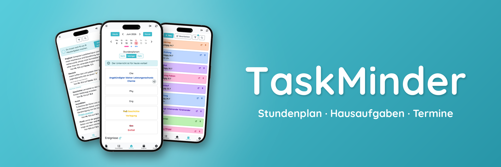

<h1 align="center">TaskMinder</h1>

  &copy; 2024-2026 Mingqi Li and Fabian Leonardi

## About TaskMinder

> **Looking for a quick overview?** Visit our landing page at [taskminder.de](https://taskminder.de).

[TaskMinder](https://app.taskminder.de) is an open-source web app for organizing school life in one place—homework, exams, excursions, timetables, substitutions, and shared files.
It’s built for classes: when one student adds or updates an entry (for example homework), the change is synced for everyone, so the whole class stays consistent and up to date.

TaskMinder is currently available in German only. We're considering expanding to more languages based on community interest!

[Join our Discord](https://discord.gg/kZGs92aMae) for active discussions, announcements, feedback and more!

### Key features
- Track homework, lessons, exams, events, timetable and substitutions (DSBMobile) in a central overview
- Collaborate with classmates through shared class and team workflows.
- Upload and manage files (e.g. class notes) relevant to your school tasks.
- Keep important information synchronized (real-time class syncing) and accessible across your school setup.
- Demo and test classes to try features without commitment

## Getting started
### Demo
You can explore TaskMinder using the demo class in two ways:
1) Open the demo join link: https://app.taskminder.de/join?class_code=demo  
   (No account required. Alternatively: click “Join class” on the main page and enter `demo` as the class code.)
2) Log in with username `demo` and password `demo` (you’ll be in the demo class automatically).

The demo data is read-only, but it provides a quick overview of the main features.
To set up your own class, log out (Einstellungen → Account) and leave the class (Einstellungen → Schüler:in).

### Test classes
**Want to try it first?** Create a test class (automatically deleted after 24 hours).  
Create an account, create a new class, and check “Create as test class”. You can join from multiple devices/accounts to see syncing in action.

### Regular classes
If you’re ready to use TaskMinder long-term, create a regular class—or convert your test class to a regular one!  
You're all set - **Have fun!**

## Built With
- **TypeScript** - Type-safe JavaScript for robust development
- **Bun** - Fast JavaScript runtime and toolkit
- **Express.js** - Backend web framework
- **Socket.IO** - Real-time bidirectional communication
- **Prisma ORM** - Type-safe database access layer
- **PostgreSQL** - Primary relational database
- **Redis** - High-performance caching and session storage
- **jQuery** - Lightweight DOM manipulation
- **Bootstrap** - Responsive UI component framework
- **Sass** - CSS preprocessor for maintainable stylesheets

## License
TaskMinder is licensed under the GNU Affero General Public License v3.0 only (AGPL-3.0-only).
Copyright © 2024–2026 Mingqi Li and Fabian Leonardi.
See [LICENSE](./LICENSE) for details.

## Links
- Contact us! [info@taskminder.de](mailto:info@taskminder.de)
- Our [Documentation](https://docs.taskminder.de) for developers
- [Legal Information](https://app.taskminder.de/about)

## Follow Us
- [Instagram](https://www.instagram.com/taskminder/)
- [Discord](https://discord.gg/kZGs92aMae)
- [WhatsApp](https://whatsapp.com/channel/0029VbAtPJCDOQIS6Ge1ph3I)
- [Mastodon](https://social.tchncs.de/@TaskMinder)
